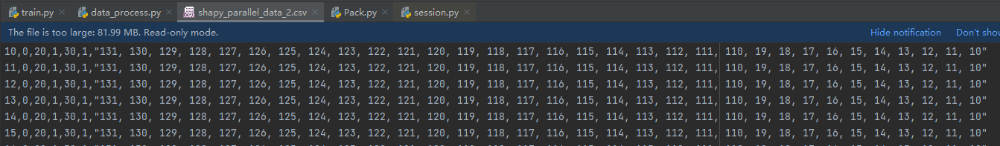

# APP-Rec
---
The codes are associated with the following paper:

> Title: APP-Rec: An Approach for Privacy-aware Mobile App Package Recommendation
---

# Dataset
> Download from https://www.kaggle.com/usernam3/shopify-APP-store

---

# Environment

> Details as requirement.txt
- Tensorflow-gpu
- ...

# Reproduce

- Code organization

Most modules are put in the `code` directory. The main modules to run the code (which you may modify to customize your experiments) are organized as follows:

| Directory | Contents |
| --------- | ------- |
| `code/data_process`       | Process the csv data. |
| `code/train.py` | Main file for training\validation\test. |
| `code/LoadData.py`     | .tfrecords file loading. |
| `code/Pack`       | Model structure. |


- Requirements
```shell script
pip install -r requirements.txt
```

- Data format
```
shapy_parallel_data_2.csv:
one review per line
author | helpful_count | app_id | price | category_id | rating | neighbor_list
```


- Data preprocess
```shell script
data preprocess:
code/data_process.py


python data_process.py
```

- Dataset organization

The datasets should be aligned as follows:
```
datadir
├── Training dataset
│   └── train_shapi_2.tfrecords
│   └── ...
├── Validation dataset
│   └── validation_shapi_2.tfrecords
│   └── ...
├── Test dataset
│   └── test_shapi_2.tfrecords
│   └── ...
...
```

- Usage

Custom experiments can be performed by running `train.py` with customized arguments. For example:
```
cd code
python train.py
```

- Main Arguments
The descriptions of general arguments are as follows:

| Parameter | Description |
| --------- | ----------- |
| theta      | Privacy budget. |
| epoch       | The number of epoch. |
| batch_size    | Batch size. |
| K       | Disentangle components. |
| reg   | Regularization. |
| lr         | Learning rate. |
| drop_out    | Dropout rate. |
| dimension    | Dimension of embedding size.|
| gpu_id    | Gpu id.|
| buffer_size   | Buffer size.|
...


- Citation
If you find this repository useful, please cite our work:

- Contact
For any issues please feel free to submit an issue. We are also open to any contributions.
